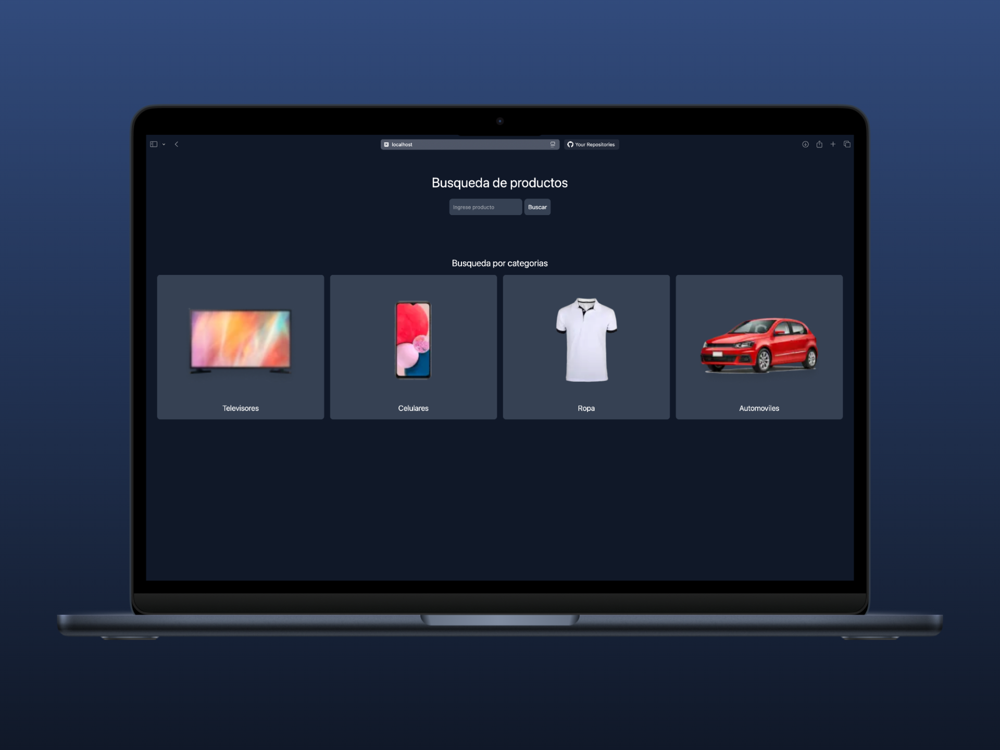
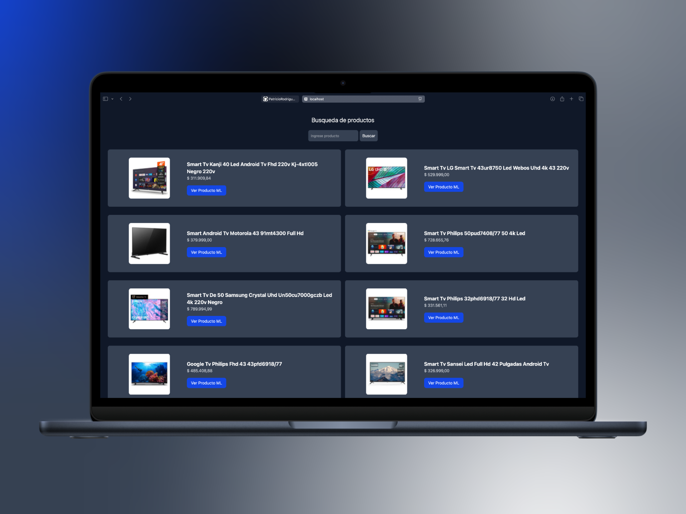
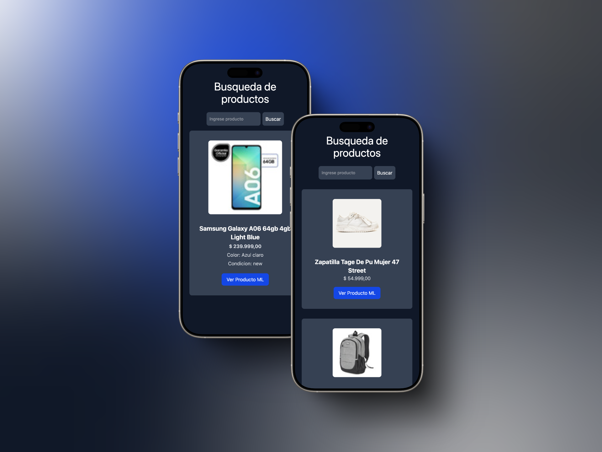

# Prueba API Mercado Libre 🛒

Este es mi primer proyecto consumiendo la API de Mercado Libre y utilizando TypeScript. 🚀

## 🛠️ Herramientas principales

  

## Funcionalidades
- Búsqueda de productos por nombre y categoría.  
- Visualización de detalles de cada producto.  
- Enlace directo a la publicación en Mercado Libre.  

## 📸 Imagenes del proyecto

